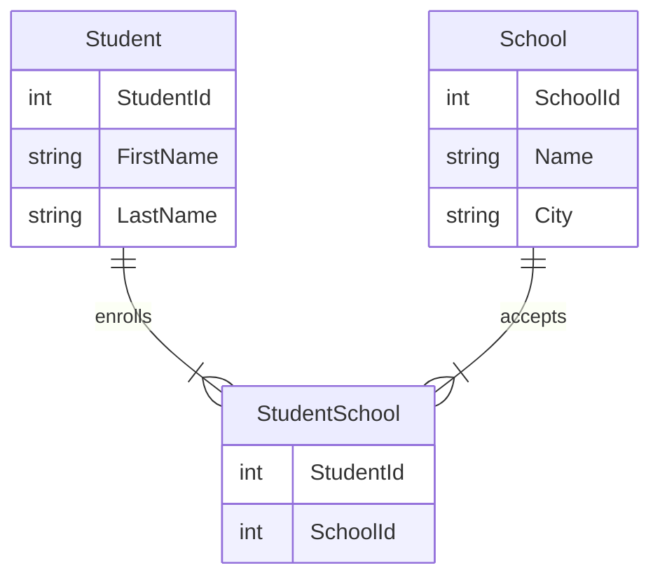

# db2022

## Beskrivning

I kursen DB2022 på IT-Högskolan skulle vi redovisa på färdigheter i SQL, Normalisering samt Java mot en relationsdatabas. Detta är min redovisning från denna kurs.

[Mermaid](https://mermaid-js.github.io/mermaid/#/entityRelationshipDiagram) är ett verktyg för att rita diagram i Markdown. Istället för exemplevis Lucidchart, valde vi Mermaid, för att få grafen kodnära.

## Entity Relationship Diagram

## Cardinality

