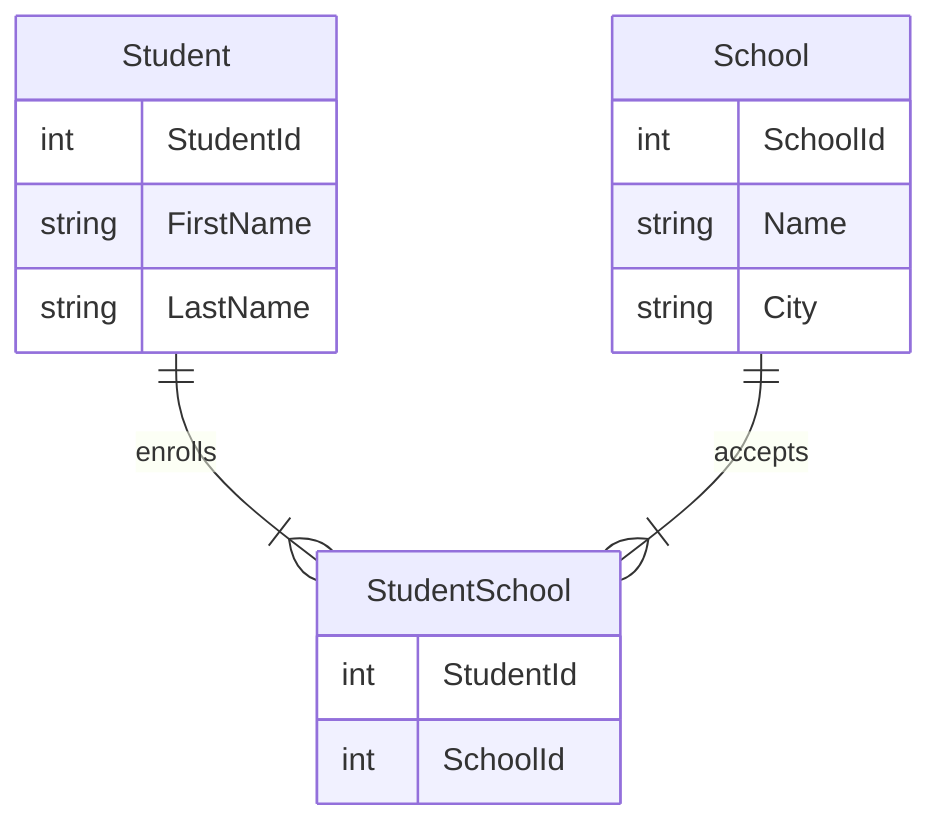
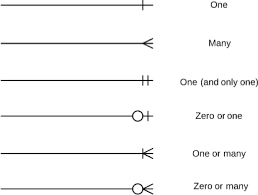

# db2022

[Mermaid](https://mermaid-js.github.io/mermaid/#/entityRelationshipDiagram)

## Entity Relationship Diagram

```mermaid
erDiagram
    Student ||--|{ StudentSchool : enrolls
    School ||--|{ StudentSchool : accepts
    
    StudentSchool {
        int StudentId
        int SchoolId
    }
    
    Student {
        int StudentId
        string FirstName
        string LastName
    }
    
    School {
        int SchoolId
        string Name
        string City
    }
    
```

## Cardinality

